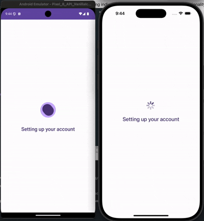

# @rn-nui/loading-indicator

Native loading indicators for React Native with enhanced functionality and cross-platform support. Read more about the [Material 3 Expressive loading indicator](https://m3.material.io/components/loading-indicator/overview).

## Installation

```bash
npm install @rn-nui/loading-indicator
```

or

```bash
yarn add @rn-nui/loading-indicator
```

### iOS Setup

No additional setup required for iOS. The component uses React Native's ActivityIndicator.

### Android Setup

You'll need to override the theme of your app under `/android/app/src/main/res/values/styles.xml` to inherit from Material3Expressive.

```xml
<resources>
    <!-- Base application theme. -->
    <style name="AppTheme" parent="Theme.Material3Expressive.DayNight.NoActionBar">
      <!-- Customize your theme here -->
    </style>
</resources>
```

### Expo Setup

There is no plugin for Expo yet. You'll need to manually edit the native files as described above.

## Usage

```typescript
import { LoadingIndicator } from '@rn-nui/loading-indicator';

// Basic loading indicator
<LoadingIndicator />

// Customized loading indicator
<LoadingIndicator
  size={50}
  color="#007AFF"
  containerSize={80}
  containerColor="#F0F0F0"
/>
```

## API Reference

### LoadingIndicator

A loading indicator component that provides uses the new Material 3 Expressive loading indicator view on Android and ActivityIndicator on iOS..

#### Properties

| Prop               | Type                           | Platform | Default     | Description                                               |
| ------------------ | ------------------------------ | -------- | ----------- | --------------------------------------------------------- |
| `size`             | `number \| 'small' \| 'large'` | Both     | `38`        | Size of the loading indicator                             |
| `color`            | `ColorValue`                   | Both     | `"#999999"` | Color of the loading indicator                            |
| `containerSize`    | `number`                       | Android  | auto        | Size of the background circle (Android only)              |
| `containerColor`   | `ColorValue`                   | Android  | `undefined` | Background color of the circle surrounding the indicator  |
| `animating`        | `boolean`                      | Both     | `true`      | Whether the loader should be shown                        |
| `hidesWhenStopped` | `boolean`                      | iOS      | `true`      | Whether the indicator is hidden when `animating` is false |

#### Size Options

- **Number**: Custom size in density-independent pixels for Android
- **'small'**: Small preset size (20dp)
- **'large'**: Large preset size (36dp)

### Screenshots

| Android with container                                       | Android without container                                    | iOS                                                      |
| ------------------------------------------------------------ | ------------------------------------------------------------ | -------------------------------------------------------- |
|  |  |  |
